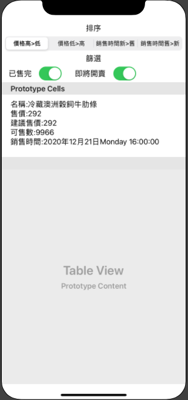

# simpletest

### ====================================

### 請 Fork 此專案開發，完成後發 Pull request

### ====================================

> 透過商品分類，呈現對應的商品清單列表
>
> 商品清單需顯示：1. 商品名稱 2. 售價 3. 建議售價 4. 可售數量... 等資訊

### Feature

- 使用原生 URLSession
- 排序
  - 價格由低到高
  - 價格由高到低
  - 銷售時間舊到新
  - 銷售時間新到舊
- 篩選
  - 尚有庫存的商品，`isSoldOut` = false
  - 尚未開賣的商品，`isComingSoon` = true
- 使用 GCD 佳

### API

- 取得***分類序號***
  - https://blooming-oasis-01056.herokuapp.com/category
  - `id`: 分類序號
  - `name`: 分類名稱
- 取得***商品資訊 (1)***
  - https://blooming-oasis-01056.herokuapp.com/product?id={id} ，id 為分類序號
  - `salePageId`: 商品序號
  - `title`: 商品名稱
  - `price`: 售價
  - `suggestPrice`: 建議售價
- 取得***商品資訊 (2)***
  - https://blooming-oasis-01056.herokuapp.com/sale?id={id} ，id 為分類序號
  - `salePageId`: 商品序號
  - `sellingQty`: 可售數量
  - `isSoldOut`: 商品已售完
  - `isComingSoon`: 商品尚未開賣
  - `sellingStartDateTime`: 銷售時間（timestamp）

### UI
- 不限 xib/storyboard/純 code
- 商品列表一定要有以下資訊，其餘欄位不限
  - 品名
  - 售價，超過 200 以紅色標示
  - 建議售價
  - 可售數
  - 銷售時間，格式不限
- 示範畫面，可自行排版

### Pull Request

請註明你是誰，例：[Joan Lee] descriptiondescription

### Contact

若對於題目有任何問題，歡迎詢問

PC Lin：pclin@91app.com

Michael Chang：michaelchang@91app.com

Joan Lee：joanlee@91app.com

### ====================================

### 請 Fork 此專案開發，完成後發 Pull request
### ====================================

